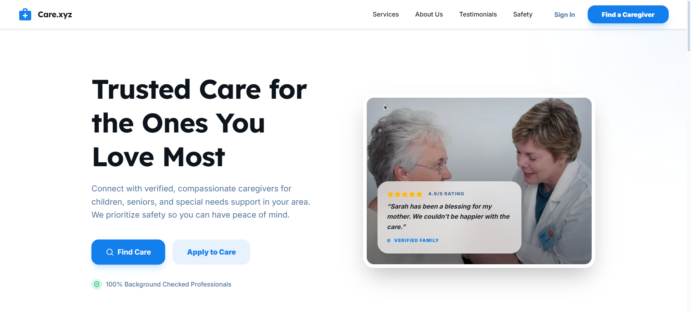

# Care.xyz 🏥  
### Premium Caregiving Network Platform

Care.xyz is a modern, high-end caregiving marketplace that connects families with professional, background-verified caregivers. Designed with a vibrant, light-mode-first UI, it delivers a seamless and trustworthy booking experience for childcare, eldercare, and specialized medical assistance.

---

## 📸 Screenshot



---

## 🚀 Live Demo

🌐 **Visit Care.io**  
https://devcat-b12a12.netlify.app/

---

## ✨ Key Features

### 💎 Premium User Experience
- 🎨 **Vibrant Light-Mode UI** with high-contrast typography and refined color harmony
- 💰 **Dynamic Pricing System** that switches between Hourly and Daily rates with real-time cost updates
- 🔔 **Elegant User Feedback** powered by SweetAlert2 for non-intrusive alerts
- 🎬 **Micro-Animations & Transitions** using Framer Motion for a premium feel

---

### 🔒 Secure Authentication & Verification
- 🔑 **Multi-Auth Support** (Email/Password + Google OAuth)
- 🪪 **User Verification** via mandatory NID Number and Contact Phone
- 🔐 **Strict Password Policies** enforced on both frontend and backend
- 🔄 **Automatic Google Account Sync** with database on social login

---

### 📅 Advanced Booking System
- 📍 **Location-Based Booking Flow**  
  Multi-step selection: Division → District → City → Area
- 🧾 **Automated Email Invoicing**  
  HTML invoices sent instantly after successful booking
- 📊 **Booking Dashboard**  
  View booking status, caretaker details, and cost breakdown
- ❌ **Secure Cancellation Flow**  
  One-click cancellation for pending bookings

---

### 🌐 Performance, Security & SEO
- 🔎 **Dynamic SEO Metadata** for every service page
- 🛡️ **Route Protection** via server-side middleware
- ⚡ **Next.js 15+ Optimized**  
  Fully compatible with async APIs and Turbopack
- 🚀 Fast page loads and optimized server rendering

---

## 🛠️ Tech Stack

### Frontend
- Next.js 15/16 (App Router)
- Tailwind CSS 4.0
- Framer Motion
- Lucide Icons
- SweetAlert2

### Backend & Services
- MongoDB (Native Driver)
- NextAuth.js
- Nodemailer (Gmail SMTP)

---

## 📦 Dependencies

Key dependencies used in this project:

- next
- react
- next-auth
- mongodb
- tailwindcss
- framer-motion
- sweetalert2
- nodemailer
- lucide-react

(Refer to `package.json` for the full list)

---

## 🚀 Getting Started

### Prerequisites
- Node.js 18+
- MongoDB database
- Gmail account (for SMTP)

### Installation

```bash
# Clone the repository
git clone https://github.com/DevCat-exe/care-xyz.git

# Navigate to the project directory
cd care-xyz

# Install dependencies
npm install

# Set environment variables
cp .env.example .env
# Fill in MongoDB, NextAuth, and SMTP credentials

# Run the development server
npm run dev
